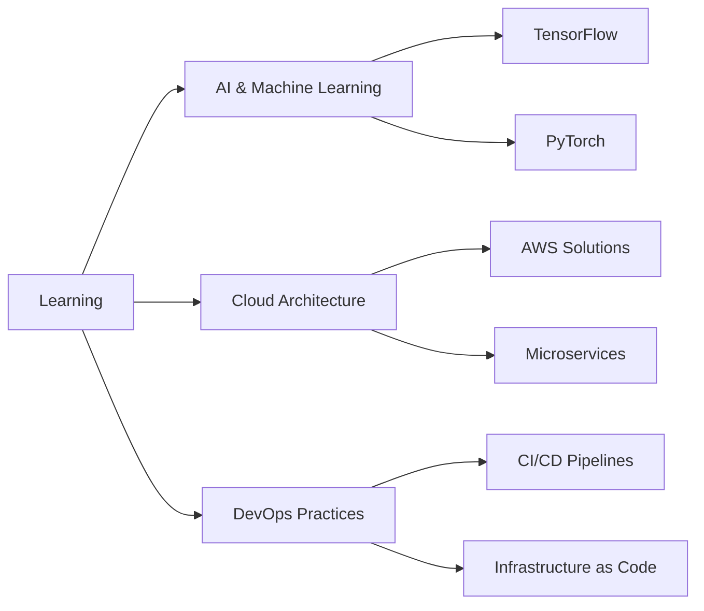

# Hi there, I'm Pedro V. Mota! 👋

<div align="center">
  
[](https://git.io/typing-svg)

</div>

---

<div align="center">
  

[](https://github.com/PedroVMota)
[](https://github.com/PedroVMota)

</div>

## 🚀 About Me

```javascript
const pedro = {
    name: "Pedro V. Mota",
    role: "Full Stack Developer",
    location: "Portugal",
    passion: ["Coding", "Technology", "Innovation"],
    currentlyLearning: ["AI/ML", "Cloud Architecture", "DevOps"],
    askMeAbout: ["Web Development", "Mobile Apps", "System Design"],
    funFact: "I debug with console.log and I'm not ashamed!"
};
```

---

## 🛠️ Tech Stack & Tools

<div align="center">

### Languages


### Frontend


### Backend


### Databases


### Cloud & DevOps


### Tools


</div>

---

## 📊 GitHub Statistics

<div align="center">
  
  
</div>

<div align="center">
  
</div>

---

## 🏆 GitHub Trophies

<div align="center">
  
</div>

---

## 📈 Activity Graph

<div align="center">
  
</div>

---

## 🔥 Contribution Snake

<div align="center">
  
</div>

---

## 💻 Workspace Setup

<div align="center">


</div>

---

## 📱 Connect with Me

<div align="center">

[](https://linkedin.com/in/pedrovmota)
[](https://twitter.com/pedrovmota)
[](https://instagram.com/pedrovmota)
[](https://discord.gg/your-discord)
[](mailto:pedro@example.com)
[](https://pedrovmota.dev)

</div>

---

## 🎯 Current Focus



---

## 📈 WakaTime Stats

<!--START_SECTION:waka-->
```text
JavaScript   12 hrs 30 mins  ████████████████████░   85.2%
TypeScript   1 hr 45 mins    ███░░░░░░░░░░░░░░░░░░   12.1%
HTML         15 mins         ░░░░░░░░░░░░░░░░░░░░░    1.8%
CSS          8 mins          ░░░░░░░░░░░░░░░░░░░░░    0.9%
```
<!--END_SECTION:waka-->

---

## ⚡ Fun Facts

<div align="center">

- 🌱 Currently exploring **Artificial Intelligence** and **Machine Learning**
- 💬 Ask me about **Full Stack Development**, **System Design**, or **Tech Career**
- 🎯 2024 Goals: Contribute more to **Open Source** projects
- 🎮 When I'm not coding, I'm probably **gaming** or **learning new technologies**
- ☕ Coffee enthusiast - **Fuel for coding sessions**

</div>

---

## 🎵 Spotify Playing

<div align="center">
  
[](https://open.spotify.com/user/your-spotify-username)

</div>

---

## 📊 Detailed Stats

<details>
<summary>📈 More GitHub Stats</summary>
<br>

<div align="center">
  
[](https://github.com/PedroVMota)

[](https://github.com/PedroVMota)

[](https://github.com/PedroVMota)

</div>

</details>

---

<div align="center">

### Show some ❤️ by starring some of my repositories!


</div>

---

**Note:** Some widgets may require additional setup:
- For the contribution snake, you'll need to set up GitHub Actions
- For WakaTime stats, you'll need to connect your WakaTime account
- For Spotify integration, you'll need to set up the Spotify API
- Update social media links with your actual profiles
